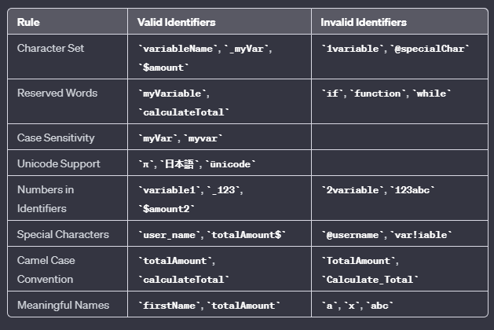
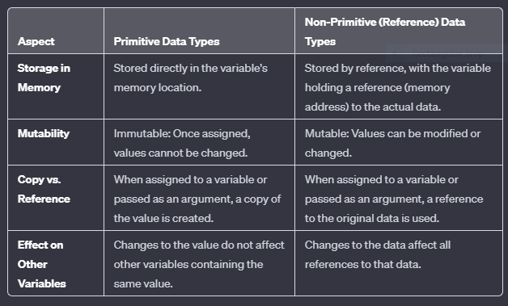
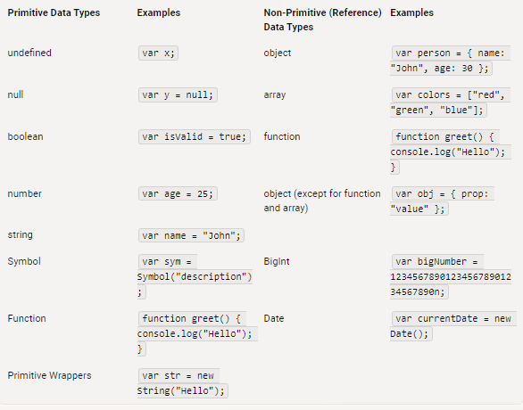

# Literals and Identifiers

A *literal* represents a specific value directly, while an identifier is a name used to refer to a variable, function, or other entities in the code.

* Examples of literals includes:

    * string literals ("Hello"), 
  
    * numeric literals (42), 
  
    * boolean literals (true), 
  
    * object literals ({ key: value }), and 
  
    * array literals ([1, 2, 3]).

* Literals are concrete values.

An *identifier* is a name given to a variable, function, or any other user-defined item in a program.

*Identifiers are used to uniquely identify and refer to variables, functions, objects, and other entities in the code.*

* Examples of identifiers include :

    * variable names (var x ;), 

* function names (function myFunction() {}), and 

    * property names in objects (obj.property).

* Identifiers are placeholders for values or references to functions or objects.

# Constants and Variables

** Constants - They can not change their value
* To declare a constant we use *const* keyword

Example:

        const accountId = 1230321;

 ** Variables - They can change their values.
* There are two ways to declare variables

 1. using *var* keyword
 2. using *let* keyword

 Example:

        let accountEmail = "abc@example.com"
        var accountPassword = "123456"

P.S. :  we should use only const and let instead of var because of the issue of scoping (block scope(let) and functional scope(var))  
*e.g.* It is possible that in a project a developer uses *var accountPassword* in one file and another developer use the same *var accountPassword* in another file then it will change the value everywhere it is used.

# Data-types
Data types are use to describe the type of data a variable will hold.

 Data types:  
1.  Primitive data types:[used by STACK memory allocation]

    * The predefined data types provided by JavaScript language are known as primitive data types. Primitive data types are also known as in-built data types.

    *   String, Number, Boolean, null, undefined, Symbol, BigInt  

 *   call by value --> copied value is passed and changes in copied values does not reflect back to original value
        
  2.  Non-Primitive data types: [used by HEAP memory allocation]  

         * The data types that are derived from primitive data types of the JavaScript language are known as non-primitive data types. It is also known as derived data types or reference data types
        
        *   Arrays, Objects, Functions
*   call by Reference --> in this we get the reference of the actual value so changes in reference value are reflected back to the original value

Primitive Data-type (Numbers)     

    let a = 5;
    let b = a;  // b gets a copy of the value of a
    a = 10;     // Changing the value of a does not affect b
    console.log(a);  // Output: 10
    console.log(b);  // Output: 5

Non-Primitive Data-type (Object)

        var obj1 = { name: "John" };
        var obj2 = obj1;         // obj2 references the same object in memory
        obj1.name = "Doe";       // Changing the object's property via obj1 affects obj2
        console.log(obj1.name);  // Output: Doe
        console.log(obj2.name);  // Output: Doe

# Symbol
 
 Symbols are immutable(cannot be changed) and are unique.

        for creating a Symbol we use Symbol() function

Syntax :       

        const x = Symbol()
        typeof x;               // symbol

        // two symbols with the same description

        const value1 = Symbol('hello');
        const value2 = Symbol('hello');

        console.log(value1 === value2); // false
       
       
        // Though value1 and value2 both contain the same description, they are different.

 * accessing the description of a symbol using .(dot) operator.

        console.log(value1.description)         // 'hello'
        
        
 * You can add symbols as a key in an object using square brackets []. For example,

            let id = Symbol("id");

            let person = {
                name: "Jack",

                // adding symbol as a key
                [id]: 123 // not "id": 123
            };

            console.log(person);                             // {name: "Jack", Symbol(id): 123}
            console.log(person[id].description)         // error because "description" is not used in object
            console.log(person[id])                               // 123
