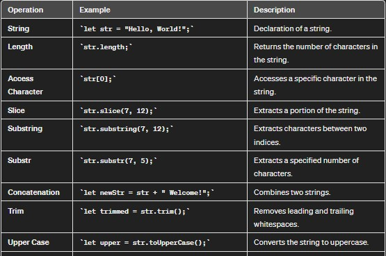
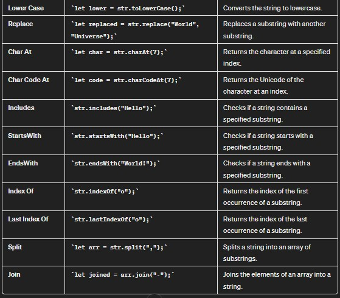

## String 
Strings are useful for holding data that can be represented in text form.  
The String object is used to represent and manipulate a sequence of characters.

##### Two ways to create a string:        
    
* as a primitive type

        const name1 = "David";

* as a String Object (Not recommended for general use)

        const name2 = new String("Roy");

        console.log(name1 === "David"); // true
        console.log(name2 === "Roy"); // false  because name2 is string object and "Roy" is string
        
        ### different types

        console.log(typeof name1); // "string"
        console.log(typeof name2); // "object" 

### Operations on String

* Character access  
    *   first method:
  ```
    const name = "Kamlesh"
    name.charAt(1)  // gives value "a"
    ```
    *   second method:
    ```
    const name = "Kamlesh"
    name[1]         //gives value "a"
    ```
    
    
    