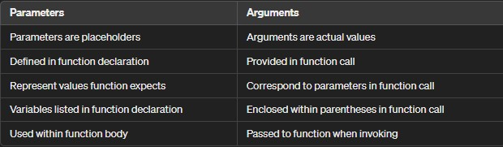
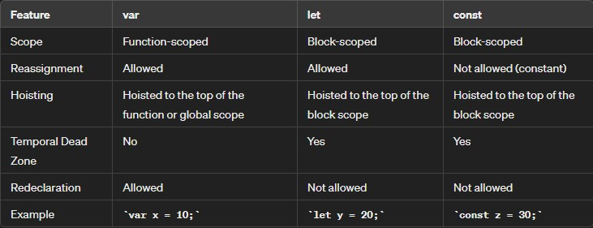

# Functions
A JavaScript function is a fundamental building block that allows you to encapsulates a set of statements to perform a specific task or calculate a value.

1.  Function definition :
    *  A JavaScript function is defined using the `function` keyword, followed by a name and parentheses. 
    * function name can contain letters, digits, underscores, and dollar signs (similar to variable names).
    * Parameters (input values) are listed inside the parentheses `()`, separated by commas.
    * The code to be executed by the function is enclosed within curly braces `{}`
    
    ```
         function functionName(parameters) {
            // code block
        }
    ```    
   

2. Function Invocation:
    * A function is executed when “something” invokes (calls) it.
    * Invocation can occur in various ways:
        * When an event happens (e.g., a user clicks a button).
        * Explicitly from JavaScript code.
        * Automatically (self-invoked).

    ```
    functionName(arguments);    
    ```
3. Function Return:
    * When a JavaScript function reaches a return statement, it stops executing.
    * If the function was invoked from a statement, JavaScript continues executing the code after the invoking statement.
    * Functions often compute a return value, which is sent back to the caller.

    ```
    function functionName() {
    return value;
    }
    ```
##### NOTE : Remember that accessing a function without parentheses (()) refers to the function object itself, while using parentheses invokes the function and returns its result

4. Handling Parameters:
    
    * Passing Parameters

    ```
    function functionName(parameter1, parameter2) {
        // code block
    }
    functionName(argument1, argument2);
    ```
5. Handling Arguments:

    * Accessing Arguments inside Function
    
    ```
        function functionName(parameter1, parameter2) {
        console.log(parameter1, parameter2);
        }
        functionName(argument1, argument2);
    ```     

##### Difference between Parameter and Argument



example: 

```
        function greet(name) {
    console.log("Hello, " + name);
}
    greet("John");

// "name" is a parameter of the greet function.

// "John" is an argument passed to the greet function 
```

### SCOPE :
* Using ***var, let, const*** 

    #### Scope:
    
    * *var* is function-scoped, meaning it is visible throughtout the function in which it is declared.
    
    * *let* and *const* are block-scoped, meaning they are only visible within the block(enclosed by curly braces{}) in which they are declared.

   #### Reassignment :

    * *var* and *let* can be reassigned to new values but *const* cannot be.

    #### Hoisting :

    * *var* declarations are hoisted to the top of their enclosing function or global scope, meanting they are available before their actual declaration.

    * *let* and *const* declarations are hoisted to the top of their enclosing block scope, bu they are not initialized until the actual declaration is evaluated. Accessing them before results in a ReferenceError.
    #### Temporal Dead Zone: 
    * *var* has no temporal dead zone.
    
    * *let* and *const* have a temporal dead zone, meaning accessing them before the declaration will result in a ReferenceError.

    #### Redeclaration :
    * *var* allows redeclaration within the same scope.

    * *let* and *const* do not allow redeclaration within the same scope.


        
